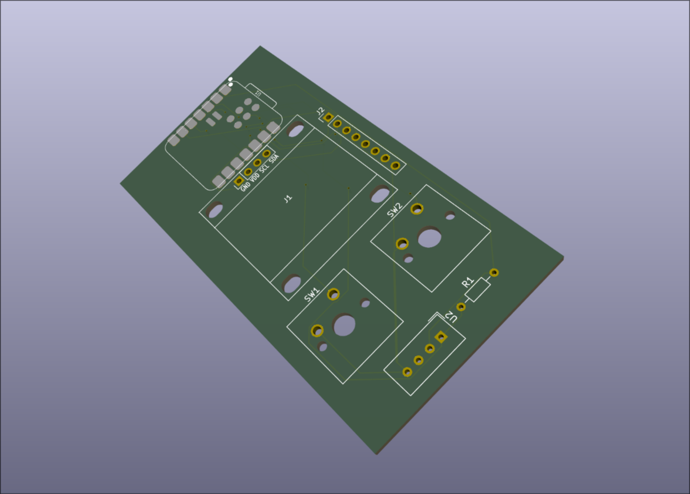
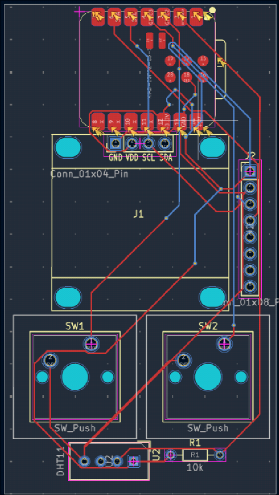
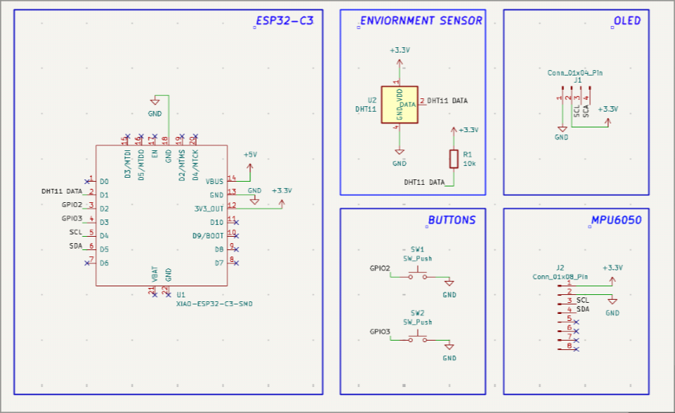

# omi

Omi is a simple desktop companion. Functionality includes date/time, timer, stopwatch, countdown, and audio visualizer which responds to the sounds in your working space (e.g. typing). It can also display humidity and temperature of your working space. It's a device that is for the most part single-purpose, meaning it doesn't occupy more of your attention than it needs.

